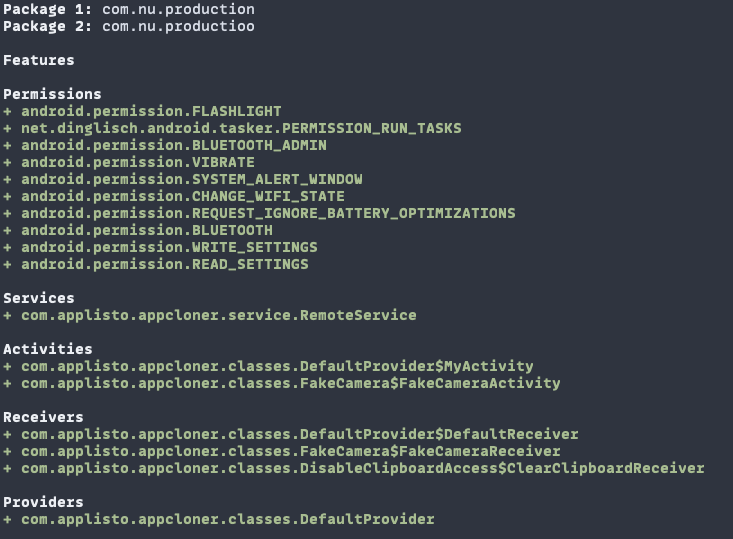

<h1 align="center">APKrash</h1>
<p>
  <a href="#" target="_blank">
    
  </a>
</p>

> Android APK security analysis toolkit

## Install

```shell
git clone https://github.com/kamushadenes/apkrash.git
cd apkrash/cmd
go build -o apkrash
```

## Requirements
- apktool
- dex2jar
- jadx

## Usage

```shell
apkrash help
```

```
Android APK security analysis toolkit

Usage:
  apkrash [command]

Available Commands:
  analyze     Analyze an APK or Manifest
  compare     Compares two APKs or Manifests
  completion  Generate the autocompletion script for the specified shell
  decompile   Decompile APK into Java code using jadx
  extract     Extract APK using apktool
  help        Help about any command
  jar         Convert APK to JAR using dex2jar

Flags:
  -c, --color           Output with color (only valid for text mode)
  -o, --format string   Output format, one of text, json, json_pretty, table (default "text")
  -h, --help            help for apkrash
  -d, --onlyDiffs       Output only diffs (only valid for text mode)

Use "apkrash [command] --help" for more information about a command.
```

### Analyze an APK or Manifest
```shell
apkrash analyze <file.apk or AndroidManifest.xml>
```

### Compare two APKs
```shell
apkrash compare <file1.apk or AndroidManifest1.xml> <file2.apk or AndroidManifest2.xml>
```

### Decompile an APK using jadx
```shell
apkrash decompile <file.apk> [output_dir]
```

### Extract an APK using apktool
```shell
apkrash extract <file.apk> [output_dir]
```

### Convert APK to JAR using dex2jar
```shell
apkrash jar <file.apk> [output_dir]
```

## Examples
### Compare two APKs showing only diffs with colored output
```shell
apkrash compare -c -d apk1.apk apk2.apk
```



### Analyze an APK and output to JSON (pretty), including files and statistics
```shell
apkrash analyze -o json_pretty -f apk.apk
```

### Compare two APKs and their source code, outputting to JSON
*Note: this may take a few minutes as the APK needs to be decompiled using jadx*
```shell
apkrash compare -o json -f -l apk1.apk apk2.apk
```

## Roadmap
- [x] Add support for AndroidManifest.xml
- [x] Add support for APKs
- [x] Add support for JARs
- [x] Add support for AABs
- [ ] Add support for downloading APKs from Play Store
- [ ] Add support for downloading APKs from other stores

## Credits
- Inspired by [AndroCompare](https://github.com/harismuneer/AndroCompare)

## Show your support

Give a ⭐️ if this project helped you!